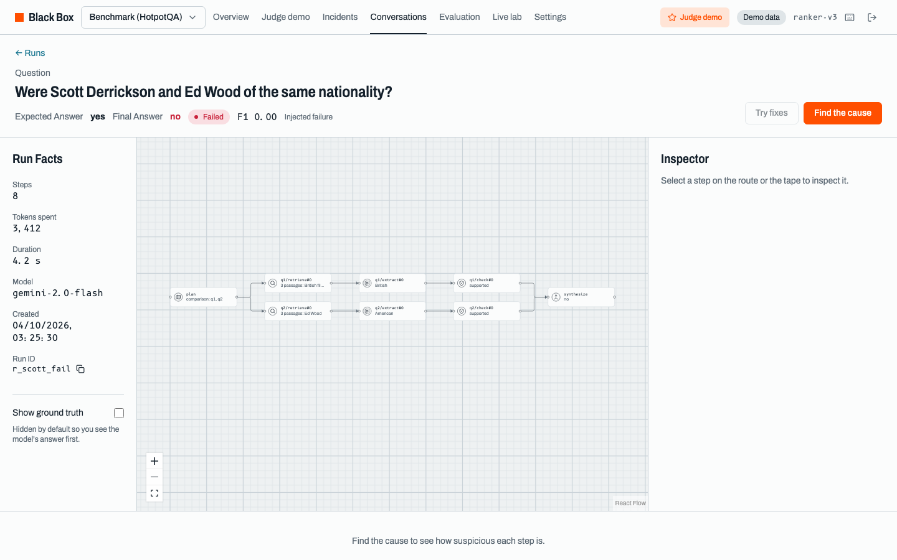
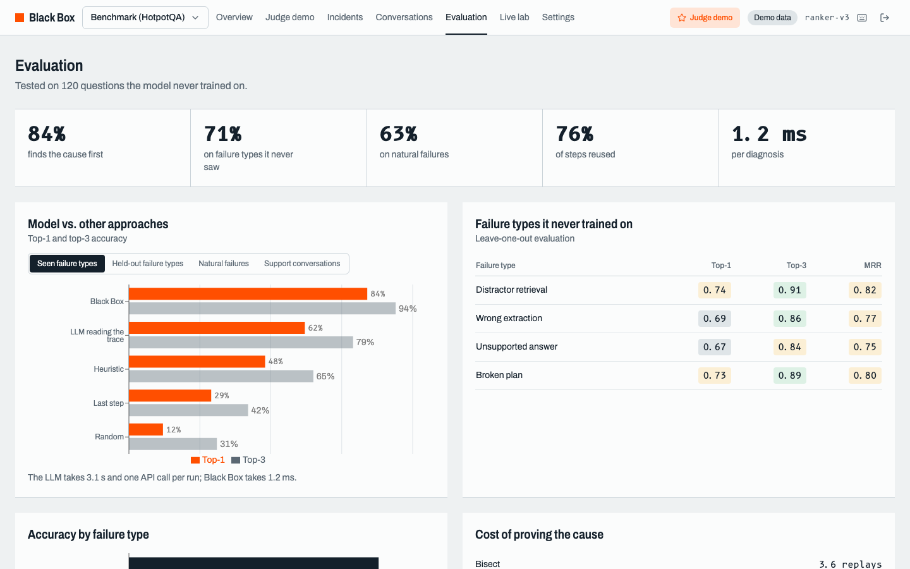
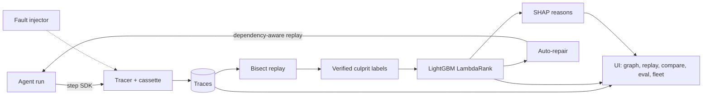
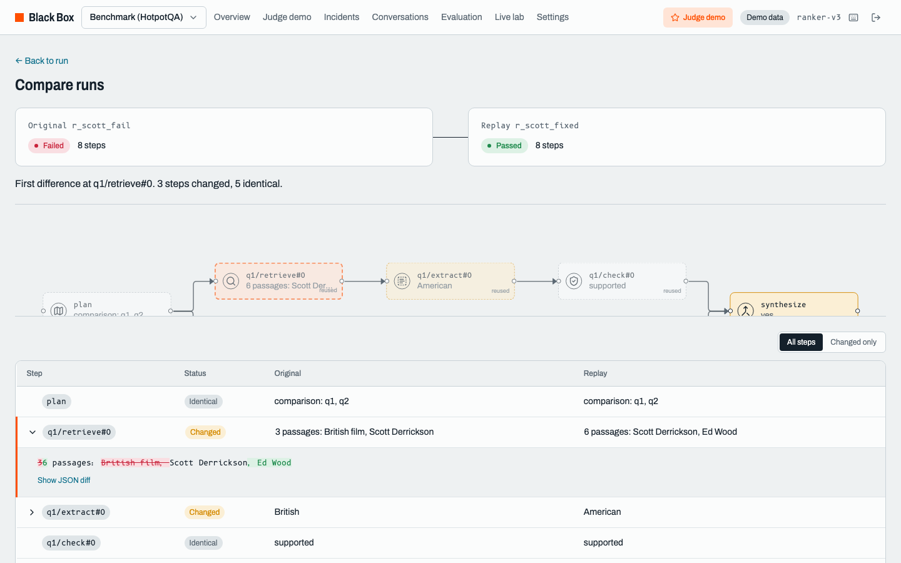

# Black Box - a flight recorder for AI agents

> Traces show you what happened. **Black Box tells you why, and proves it.**

Built for **Bit N Build 2026** (GDG On Campus, Fr. CRCE), AI/ML Problem Statement 2.

An AI agent runs a dozen steps and gets the answer wrong. One step was responsible. Black Box learns to find it from execution traces, proves the diagnosis by counterfactual replay, explains it with evidence from the trace, and repairs the run by re-executing only the steps the fix actually affects.



## What makes it different

- **Counterfactual blame.** A step is the cause only if changing it flips the outcome. Bisect replay verifies that label before training.
- **Dependency-aware replay.** Changing a step re-executes only steps whose inputs changed; unaffected branches are reused from the recording.
- **Held-out evaluation.** The evaluation pipeline separates seen fault types, held-out fault types, and natural failures by task ID.
- **Auto-repair.** Fix candidates for the top suspects are replayed in parallel from the checkpoint.

## Results

The final generation attempt on October 3, 2026 exhausted the configured Gemini daily quota after 20 requests. The resulting artifact contains zero evaluable test runs, so reporting `0%` would be misleading; the metrics are unavailable until generation resumes and evaluation is rerun.

| Test set | Model Top-1 | Model Top-3 | LLM-as-judge Top-1 |
|---|---:|---:|---:|
| Seen fault types | N/A (n=0) | N/A (n=0) | N/A (n=0) |
| Held-out fault types | N/A (n=0) | N/A (n=0) | N/A (n=0) |
| Natural failures | N/A (n=0) | N/A (n=0) | N/A (n=0) |

- Diagnosis latency: N/A (n=0); LLM-as-judge time: N/A (n=0)
- Replay reuse: N/A (0 evaluated replays)
- Bisect cost: N/A (0 evaluated labels)
- Auto-repair success: N/A at top-1 and top-3



## How it works



1. **Capture** every plan, retrieve, extract, check, reformulate, and synthesis step.
2. **Break** runs with realistic, targeted agent faults.
3. **Prove** the responsible step through counterfactual bisect replay.
4. **Learn** a leakage-free ranker from verified labels.
5. **Explain** each diagnosis with feature evidence from the trace.
6. **Fix** candidates from the checkpoint while reusing unaffected work.



## Problem statement coverage

| Feature | Implementation |
|---|---|
| Execution data | `blackbox/sdk/tracer.py`, run browser |
| Failure diagnosis | `blackbox/model/`, Run Detail ranking |
| Failure explanation | `blackbox/model/explain.py`, Why panel |
| Checkpointed replay | `blackbox/replay/engine.py`, Replay tab |
| Alternative execution | `blackbox/repair/`, Auto-repair drawer |
| Model evaluation | `blackbox/model/evaluate.py`, Evaluation page |
| Trace comparison | `blackbox/replay/compare.py`, Compare page |

## Quickstart

```bash
cp .env.example .env          # add GEMINI_API_KEY
make install
.venv/bin/bb db init
.venv/bin/bb corpus build
.venv/bin/bb generate all --limit-tasks 50
.venv/bin/bb features build
.venv/bin/bb train
.venv/bin/bb eval --judge-limit 30
./start.sh                    # App and API together
```

`start.sh` runs the real development stack at `http://127.0.0.1:5173`, with the
API at `http://127.0.0.1:8000`. It uses the configured LLM provider and Neon
Postgres when `DATABASE_URL` is set, with SQLite available as a local fallback.
Startup also idempotently seeds historical Nimbu Living support activity: 80
completed conversations, diagnosed failures, full traces, and four incidents.
SMTP delivery uses the provider configured in `.env`.

For an offline presentation using pre-recorded LLM cassettes, use the separate
demo stack:

```bash
make demo                     # http://127.0.0.1:4173
```

`make demo` sets `BLACKBOX_DEMO_MODE=1`; it is intentionally not a live-backend
verification command.

## Tech

Python, FastAPI, Neon Postgres/SQLModel, Gemini, sentence-transformers, LightGBM, SHAP, React, TypeScript, Vite, TanStack Query, React Flow, Recharts, and Tailwind CSS.
