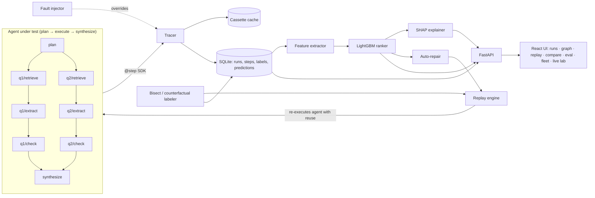

# 02 — Architecture

## System overview



## Components

| Component | Package path | Responsibility |
|---|---|---|
| Config | `blackbox/config.py` | Settings from `.env` (pydantic-settings) |
| Storage | `blackbox/store/` | SQLModel tables, session helper, repository functions |
| LLM client | `blackbox/llm/` | Provider abstraction: `gemini`, `groq`, `fake`; JSON output; token usage |
| Cassette | `blackbox/sdk/cassette.py` | Content-addressed cache of LLM and tool calls (SQLite table) |
| Tracer SDK | `blackbox/sdk/tracer.py` | `ExecutionContext`, `step()` — records, reuses, overrides |
| Corpus/retrieval | `blackbox/corpus/` | HotpotQA loading, passage store, MiniLM embeddings, cosine top-k |
| Agent | `blackbox/agent/` | Plan-execute agent, prompts, answer scoring |
| Faults | `blackbox/faults/` | 6 fault types as step overrides |
| Replay | `blackbox/replay/` | Replay runs with overrides / freeze points; reuse stats |
| Labeling | `blackbox/labeling/` | Bisect for injected faults, resampling counterfactuals for organic failures |
| Data gen | `blackbox/datagen/` | Resumable, rate-limited bulk run generation |
| Features | `blackbox/features/` | Step feature table (pandas) |
| Model | `blackbox/model/` | Train, predict, baselines, evaluation, explanations |
| Repair | `blackbox/repair/` | Fix-candidate strategies + parallel replays |
| API | `blackbox/api/` | FastAPI app |
| CLI | `blackbox/cli.py` | Typer CLI `bb ...` |
| Frontend | `frontend/` | React + Vite + TypeScript |

## Repo layout

```
blackbox/                  # python package
  config.py  cli.py
  store/  llm/  sdk/  corpus/  agent/  faults/  replay/  labeling/
  datagen/  features/  model/  repair/  api/
tests/                     # pytest, FakeLLM only
frontend/                  # vite react-ts app
data/                      # gitignored: hotpot cache, embeddings, blackbox.db
artifacts/                 # gitignored: model.txt, feature stats, eval reports
docs/  .github/
pyproject.toml  Makefile  .env.example  README.md
```

## Tech stack

**Backend:** Python 3.11, FastAPI, Uvicorn, SQLModel (SQLite), pydantic v2, pydantic-settings, Typer, `google-genai`, `openai` (for Groq's OpenAI-compatible API), `sentence-transformers` (`all-MiniLM-L6-v2`), numpy, pandas, `datasets` (HotpotQA), LightGBM, SHAP, scikit-learn, rapidfuzz, tenacity, pytest, ruff.

**Frontend:** React 18 + Vite + TypeScript, Tailwind CSS, TanStack Query, React Router, React Flow (`@xyflow/react`) + `dagre` for layout, Recharts, `diff` (npm) for text diffs.

No GPU needed. Everything runs on a laptop.

## Key design decisions (be ready to defend these)

**D1. Our own plan-execute agent, not a framework.** Replay needs full control of every step's inputs and outputs. A framework hides those. The agent is ~300 lines.

**D2. Plan-execute instead of ReAct.** In ReAct every step reads the whole scratchpad, so every step depends on every earlier step and "dependency-aware replay" would be fake. Plan-execute produces a real DAG: HotpotQA *comparison* questions give two independent branches; *bridge* questions give a sequential dependency. Changing branch q1 doesn't touch branch q2.

**D3. Replay = deterministic re-execution with memoization** (like Temporal/Prefect workflows), not memory snapshot restore. The agent program re-runs; each step whose key exists in the source run and whose input hash matches is served from the recording instantly. Input-hash equality is the reuse rule, so propagation of changes is automatic and exact. State snapshots are still stored per step for display.

**D4. Stable step keys.** Every step has a deterministic key like `q2/extract#0` (node / name # attempt). Keys align steps across runs for replay, diff, and labels.

**D5. Faults are overrides applied through the tracer**, not code branches in the agent. The same mechanism powers faults, manual edits, bisect, and repair.

**D6. The cassette stores raw outputs before faults.** So "regenerate this step" at temperature 0 returns the clean output — which is what makes bisect exact for injected faults.

**D7. LightGBM LambdaRank.** The task is "rank steps within a run", so we optimize ranking directly. Trains in seconds, SHAP gives exact explanations.

**D8. Splits by task.** Test tasks never appear in training, and contrastive features never reference the same task. Prevents leakage that would inflate results.

**D9. Demo mode.** `BLACKBOX_DEMO_MODE=1` makes the LLM client cassette-only (a miss raises an error instead of calling the network). The demo can't be killed by Wi-Fi.
